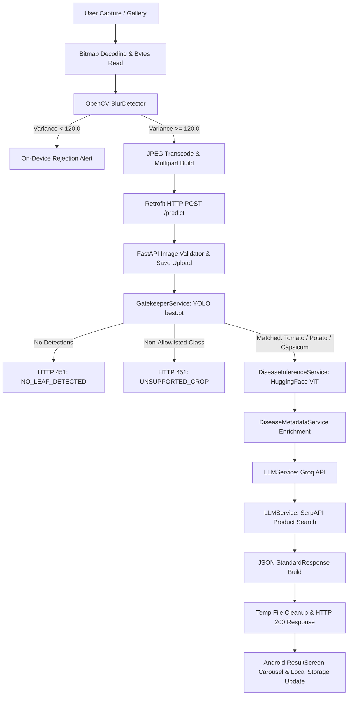
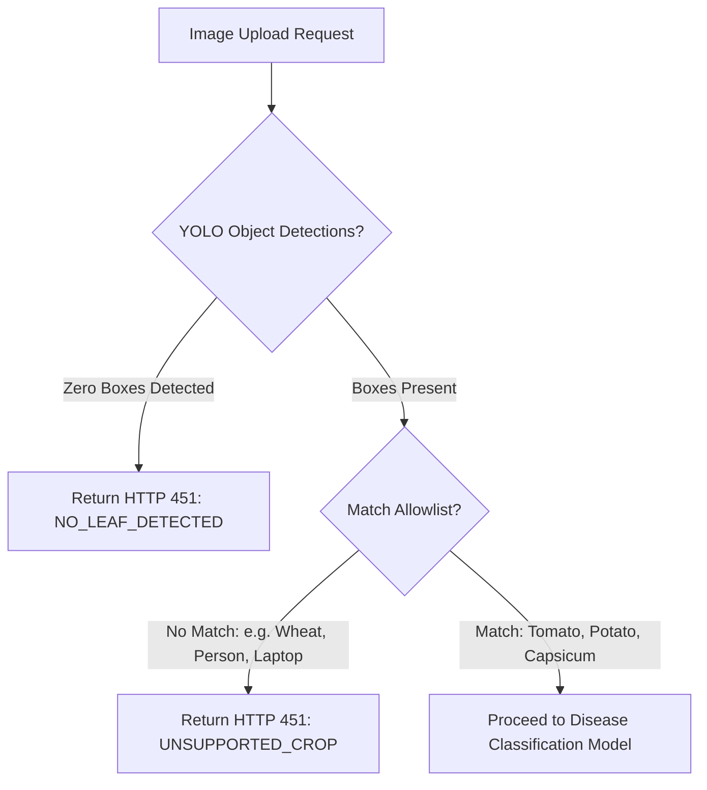
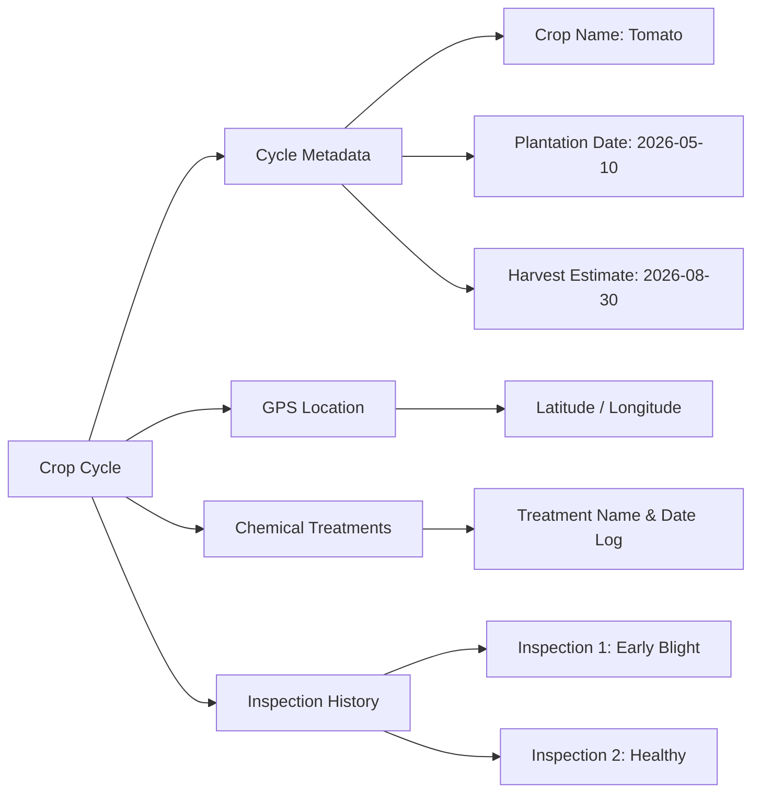
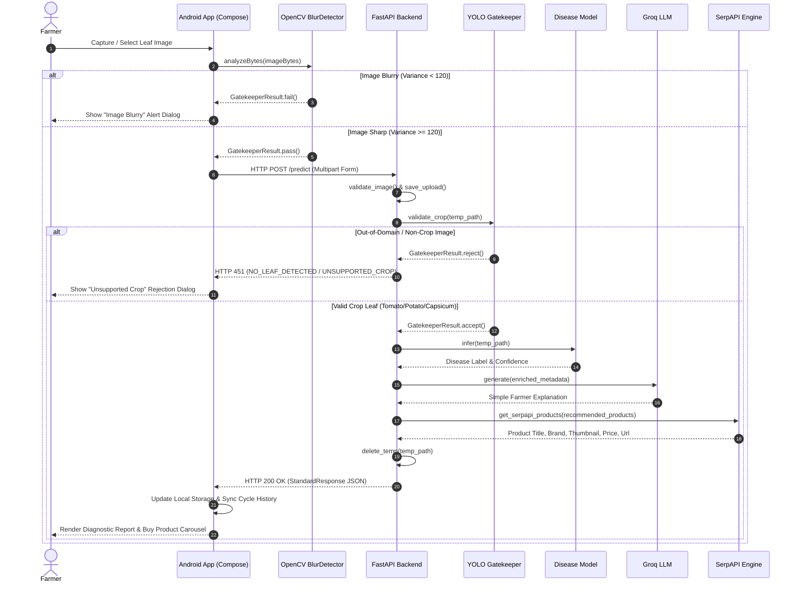

# FarCrop V2 — Technical Design Document & Architecture Specification
**AI Crop Health & Lifecycle Management Platform**

---

## 1. Executive Summary

### Problem
In traditional precision agriculture, smallholder farmers face severe diagnostic barriers:
1. **Misdiagnosis & Delayed Intervention**: Plant diseases spread rapidly. Without immediate expert guidance, farmers misapply chemical treatments or delay action, losing up to 40–100% of crop yield.
2. **AI Computational Waste & Gatekeeper Fragility**: Generic cloud-based image classifiers fail when presented with out-of-domain images (blurry photos, non-leaf objects, unsupported crops, or human faces). Running high-parameter disease classification or LLM inference on invalid uploads wastes cloud GPU/CPU compute, incurs API costs, and produces dangerous hallucinated diagnoses.
3. **Lack of Lifecycle Context**: Single-photo leaf diagnostics ignore crop age, geographical location, previous chemical treatments, and harvest timelines—leading to generic advice rather than actionable agronomic field management.

### Solution
**FarCrop V2** transforms mobile disease diagnosis into a complete **AI Crop Management Platform**. It introduces a two-tier edge/cloud multi-stage gatekeeper hierarchy:
- **Tier 1 (Edge/Device)**: On-device OpenCV Laplacian variance edge analysis to immediately reject blurry frames before network transmission.
- **Tier 2 (Cloud Gatekeeper)**: A dedicated YOLO object detection model running on the backend to enforce spatial leaf detection and crop class allowlisting before invoking high-complexity disease models.
- **Contextual Agronomic Lifecycle**: Diagnostics are attached to persistent **Crop Cycles** (tracking plantation dates, estimated harvest, GPS coordinates, historical treatments, and field notes).
- **Enriched Agronomic Intelligence & E-Commerce Integration**: Integrates specialized disease metadata, Groq LLM-driven farmer-friendly explanations, and regional SerpAPI affiliate search for genuine treatment products.

### Architecture Overview
```
[Android Client (Jetpack Compose / MVVM)]
       │
       ▼ (1. On-Device Blur Check via OpenCV)
[BlurDetector (Laplacian Variance >= 120.0)]
       │ (Passes clean JPEG)
       ▼ (2. HTTP/Multipart POST /predict)
[FastAPI Backend Orchestrator]
       │
       ├──► [YOLO Gatekeeper (best.pt)] ───► Reject (HTTP 451: NO_LEAF_DETECTED / UNSUPPORTED_CROP)
       │         │ (PASS: Tomato, Potato, Bell Pepper)
       │         ▼
       ├──► [HuggingFace Disease Model (PyTorch/Transformers)] ──► Disease + Confidence
       │         │
       ├──► [Disease Metadata Service] ──────────────────────────► Cause, Symptoms, Treatments
       │         │
       ├──► [Groq LLM Service (gpt-oss-120b)] ────────────────────► Simple Farmer Explanation
       │         │
       └──► [SerpAPI Google Shopping Engine] ─────────────────────► Regional Product Carousel Data
                 │
                 ▼ (HTTP 200 OK Standard JSON)
[Android UI: Result Carousel & Local Storage Synchronization]
```

### Current Capabilities & Future Roadmap
- **Current Capabilities**: On-device blur analysis, multi-stage gatekeeper rejection, offline local storage for crop cycles/inspections, automated GPS location capture, regional product price/buy recommendations, full Android V2 theme (Leaf Green, Cream, Earth Brown).
- **Future Roadmap**: Multi-tenant cloud synchronization, historical weather API integration, drone/satellite field mapping, on-device offline TFLite disease inference, and automated disease progression risk modeling.

---

## 2. Complete Architecture

The system operates across a dual-environment pipeline: an **Android Client** written in Kotlin/Jetpack Compose and a **Python FastAPI Cloud Engine**.

### Component Flow Diagram



---

## 3. Repository Structure

### Directory Tree & File Responsibilities

```
farcrop/
├── gatekeeper/
│   └── best.pt                           # YOLOv8 leaf detection weights (46 classes)
├── backend/
│   ├── app/
│   │   ├── api/
│   │   │   └── routes.py                 # FastAPI route orchestrator (/predict, /health, /)
│   │   ├── models/
│   │   │   └── schemas.py                # Pydantic models (StandardResponse, CropCycleMetadata, etc.)
│   │   ├── services/
│   │   │   ├── cycle_parser.py           # Form data to Pydantic CropCycleMetadata parser
│   │   │   ├── disease_service.py        # Legacy metadata & LLM helper service
│   │   │   ├── gatekeeper_service.py     # Wrapper isolating LeafDetector from routes
│   │   │   ├── inference.py              # CropDiseaseModel singleton (HuggingFace Transformers/PyTorch)
│   │   │   ├── inference_service.py      # Wrapper isolating CropDiseaseModel from routes
│   │   │   ├── llm_service.py            # Groq LLM integration & SerpAPI shopping product search
│   │   │   └── metadata_service.py       # Agronomic disease database (cause, description, products)
│   │   ├── utils/
│   │   │   └── image.py                  # Image validation, disk persistence, temp file cleanup
│   │   ├── config.py                     # Environment variables, model paths, API keys
│   │   └── main.py                       # FastAPI application entry point, lifecycle events, exception handlers
│   ├── gatekeeper/
│   │   ├── __init__.py
│   │   ├── leaf_detector.py              # LeafDetector singleton & YOLO inference execution
│   │   └── result.py                     # GatekeeperResult data class
│   └── requirements.txt                  # Python backend dependencies
└── app/                                  # Android Application Root
    └── app/src/main/java/com/example/farcrop/
        ├── MainActivity.kt               # Navigation host & activity entry point
        ├── gatekeeper/
        │   ├── BlurDetector.kt           # OpenCV Laplacian variance algorithm
        │   ├── Gatekeeper.kt             # Android pre-upload validation orchestrator
        │   ├── GatekeeperResult.kt       # Local check result state
        │   └── ImageQuality.kt           # Future expansion quality hooks
        ├── model/
        │   ├── CropCycle.kt              # Local data models (CropCycle, Treatment, Inspection)
        │   └── V2StandardResponse.kt     # Retrofit response models (V2StandardResponse, BuyLink, etc.)
        ├── network/
        │   ├── ApiService.kt             # Retrofit HTTP interface (@POST @Body, @GET)
        │   └── RetrofitClient.kt         # OkHttpClient & Gson converter factory
        ├── repository/
        │   ├── CropCycleRepository.kt    # SharedPreferences local storage manager for crop cycles
        │   └── PredictionRepository.kt  # JPEG transcoding, manual MultipartBody construction, HTTP execution
        ├── ui/
        │   ├── components/               # Reusable Compose UI widgets
        │   ├── screens/
        │   │   ├── CaptureInspectionScreen.kt # Camera/Gallery launcher & on-device blur gate
        │   │   ├── CreateCropCycleScreen.kt  # New cycle form with date pickers & GPS auto-detection
        │   │   ├── CropCycleDetailsScreen.kt # Inspection history & cycle timeline
        │   │   ├── CropCyclesScreen.kt       # Active cycle management list
        │   │   ├── HomeScreen.kt             # Greeting, stats counter, quick action FAB
        │   │   ├── MainScreenContainer.kt    # Bottom navigation bar layout (Home, Cycles, Settings)
        │   │   ├── ResultScreen.kt           # Diagnostic report, severity badge, product carousel
        │   │   └── SettingsScreen.kt         # Server IP, Port, Route configuration & connection test
        │   ├── theme/                    # Color.kt, Theme.kt (Leaf Green, Cream, Earth Brown)
        │   └── viewmodel/
        │       └── CropCycleViewModel.kt # Unified ViewModel managing cycles, location, upload states
        └── utils/
            └── PreferenceManager.kt      # SharedPreferences wrapper for network and local state
```

---

## 4. Complete Request Lifecycle

Here is the exact technical trace of an inspection upload:

1. **User Action**: User opens `CaptureInspectionScreen` for a specific Crop Cycle (`cycleId`) and taps **Take Photo** or **Choose from Gallery**.
2. **Camera Capture**: `ActivityResultContracts.TakePicture()` writes the image to a cache file `IMG_*.jpg` created via `FileProvider.getUriForFile()`.
3. **Byte Reading**: `CropCycleViewModel.uploadInspection()` calls `readUriBytes(context, uri)` on `Dispatchers.IO` to read raw bytes.
4. **On-Device Blur Gate**:
   - Passes `imageBytes` to `Gatekeeper(context).analyzeBytes(imageBytes)`.
   - `BlurDetector.detect(bitmap)` initializes OpenCV native binaries (`OpenCVLoader.initLocal()`).
   - Downscales bitmap to max 320px side.
   - Converts to greyscale `Mat` (`Imgproc.COLOR_RGBA2GRAY`).
   - Applies 3×3 Laplacian kernel (`Imgproc.Laplacian`).
   - Calculates standard deviation using `Core.meanStdDev()` and squares it for variance.
   - If variance < 120.0, returns `GatekeeperResult.fail()`. `_uploadState` becomes `V2UploadState.Rejected`. UI renders an error banner and halts transmission.
5. **Image Transcoding & Multipart Construction**:
   - `PredictionRepository.uploadImage()` re-encodes raw bytes via `BitmapFactory.decodeByteArray()` and `bitmap.compress(Bitmap.CompressFormat.JPEG, 92, outputStream)` to guarantee clean JPEG headers.
   - Manually constructs `MultipartBody.Builder()` with `image` part (`leaf_timestamp.jpg`), string form parts (`cycle_id`, `crop_name`, `plantation_date`, etc.), and JSON array part (`treatments`).
6. **Network Transmission**:
   - `RetrofitClient` issues HTTP `POST` to `http://<ip>:<port>/<route>`.
7. **FastAPI Processing (`routes.py:predict_disease`)**:
   - `validate_image()` checks Content-Type, verifies 5MB limit, and runs `Image.open().verify()`.
   - `CropCycleParserService.parse()` validates crop cycle metadata into `CropCycleMetadata` Pydantic model.
   - `save_upload()` writes file to `backend/uploads/filename_hash.jpg`.
8. **Cloud Gatekeeper Evaluation (`leaf_detector.py`)**:
   - `GatekeeperService.validate_crop()` passes image path to singleton `LeafDetector.detect()`.
   - `LeafDetector` executes YOLO inference (`self._model(image_path)`).
   - Iterates bounding boxes, fetches class labels from `model.names`, matches against `_SUPPORTED_CROPS` allowlist (`tomato`, `potato`, `capcicum`).
   - If no detections occur -> returns `GatekeeperResult.reject(code="NO_LEAF_DETECTED")`.
   - If detections exist but none match allowlist -> returns `GatekeeperResult.reject(code="UNSUPPORTED_CROP")`.
   - Route intercepts rejection and returns HTTP `451 Unavailable For Legal Reasons` with structured JSON failure.
9. **Disease Model & Metadata Enrichment**:
   - If Gatekeeper passes -> `DiseaseInferenceService.infer()` passes path to `CropDiseaseModel.predict()`.
   - Image processor transforms image into tensor; PyTorch model outputs logits; Softmax yields confidence score; label normalized (`Tomato___Early_blight`).
   - `DiseaseMetadataService.enrich()` adds cause, description, treatment steps, and recommended product names.
10. **LLM & Product Search**:
    - `LLMService.generate()` invokes Groq LLM (`openai/gpt-oss-120b`) for a farmer-friendly explanation.
    - `LLMService.get_serpapi_products()` queries Google Shopping via SerpAPI for India (`gl=in`, `location=India`) to extract `title`, `brand`, `thumbnail`, `price`, `rating`, `url`.
11. **Response Build & Disk Cleanup**:
    - Response packed into `StandardResponse.build_success()`.
    - `delete_temp()` deletes temporary upload file from disk in a `finally` block.
    - Server returns HTTP `200 OK`.
12. **Android UI Rendering & Local Persistence**:
    - Android receives JSON; `PredictionRepository` returns `V2StandardResponse`.
    - `CropCycleViewModel` appends a new `Inspection` model to the local `CropCycle` and persists to `SharedPreferences` via `CropCycleRepository`.
    - Navigates to `ResultScreen` to render diagnosis badges, progress indicators, AI explanation, treatment steps, and the product recommendation carousel.

---

## 5. Backend Deep-Dive

### FastAPI Startup Lifecycle
In `app/main.py`, FastAPI registers an `on_event("startup")` handler:
1. **Gatekeeper Loading**: Calls `leaf_detector.load(model_path=GATEKEEPER_MODEL_PATH)`. Resolves model path to `farcrop/gatekeeper/best.pt`. Logs model configuration and 46 class mappings. If file is missing, logs a `CRITICAL` alert (fail-closed mode).
2. **Disease Classifier Loading**: Calls `crop_disease_model.load_model()`. Resolves model path to `farcrop/models/crop_model` or `farcrop/crop`. Loads PyTorch safetensors/bin weights onto CPU memory and sets model to evaluation mode (`model.eval()`).

### Service Layer Architecture
- `CropCycleParserService`: Converts form strings into validated `CropCycleMetadata` models.
- `GatekeeperService`: Wraps `leaf_detector` singleton.
- `DiseaseInferenceService`: Isolates disease model execution from API routes.
- `DiseaseMetadataService`: Houses internal Agronomic Database mapping disease keys to cause, description, treatments, and product keywords.
- `LLMService`: Handles Groq API communications and SerpAPI product extraction.

### Global Exception Handlers
Registered in `app/main.py`:
- `HTTPException`: Standardizes failure responses to `StandardResponse.build_failure(stage="request")`.
- `RequestValidationError`: Formats Pydantic schema validation errors into HTTP 422 standard JSON.
- `Exception`: Catches unhandled errors, returning HTTP 500 without leaking stack traces.

---

## 6. Android Application Architecture

### Architecture Pattern: MVVM + Repository
- **UI Layer (Jetpack Compose)**: Screens (`HomeScreen`, `CropCyclesScreen`, `CreateCropCycleScreen`, `CropCycleDetailsScreen`, `CaptureInspectionScreen`, `ResultScreen`, `SettingsScreen`) render state emitted by `CropCycleViewModel`.
- **ViewModel Layer**: `CropCycleViewModel` manages UI state via `StateFlow` (`cropCycles`, `uploadState`, `connectionState`, `cameraUri`).
- **Repository Layer**:
  - `CropCycleRepository`: Handles JSON serialization of local crop cycles to `SharedPreferences`.
  - `PredictionRepository`: Performs JPEG byte re-encoding, manual OkHttp `MultipartBody` construction, and Retrofit HTTP execution.
- **Network Layer**: `RetrofitClient` constructs OkHttpClient with 30s connect / 60s read timeouts and Gson converter.

### Navigation Architecture
`MainActivity` uses Jetpack Compose `NavHost`:
- `"main"`: Displays `MainScreenContainer` (bottom navigation switching between Home, Cycles, Settings).
- `"create_crop_cycle"`: Screen to create new crop cycles with DatePickerDialogs and GPS detection.
- `"crop_cycle_details/{cycleId}"`: Displays cycle details and inspection history timeline.
- `"capture_inspection/{cycleId}"`: Camera/Gallery selection with live blur feedback.
- `"result/{responseJson}/{cycleId}"`: Renders detailed scan report and product recommendations.

---

## 7. AI Models Specifications

### Model 1: Blur Detection Engine (On-Device Edge Quality Gate)
- **Purpose**: Detect blurry/unfocused camera frames on device before cloud upload.
- **Framework**: OpenCV for Android (C++ native core via JNI / Java `OpenCVLoader.initLocal()`).
- **Input**: Android `Bitmap` image.
- **Output**: `GatekeeperResult` (boolean `passed`, float `confidence`, string `reason`).
- **File Name**: Bundled in OpenCV Android SDK native `.so` libraries.
- **Where it Loads**: `BlurDetector.ensureOpenCvLoaded()` loads native libraries dynamically on first use.
- **Inference Details**: Downscales image to 320px max dimension -> converts RGBA to Greyscale -> applies 3×3 Laplacian edge detection operator -> calculates scalar variance of pixel intensities.
- **Average Inference Time**: ~5–15 ms per frame on standard mobile ARM processors.
- **Confidence Calculation**: `(variance / 120.0).coerceIn(0.0, 1.0)`.
- **Model Size**: ~10–15 MB (native binary libs).
- **Parameters**: 3×3 Laplacian differential kernel operator.
- **Advantages**: Executes zero cloud network requests, saves bandwidth and API token usage, instantaneous user feedback.
- **Limitations**: Measures high-frequency spatial variation; cannot evaluate semantic content or object class.

### Model 2: YOLO Gatekeeper (Cloud Spatial Crop Validator)
- **Purpose**: Validate spatial presence of crop leaves and enforce crop class allowlist.
- **Framework**: Ultralytics YOLOv8 (PyTorch framework).
- **Input**: Image file path (JPEG/PNG).
- **Output**: List of bounding boxes, class IDs, confidence scores, label names.
- **File Name**: `best.pt` (located at `farcrop/gatekeeper/best.pt`).
- **Where it Loads**: Loaded once during FastAPI startup in `LeafDetector.load()`.
- **Inference Details**: `self._model(image_path, verbose=False)` detects candidate objects across 46 classes. Labels are checked against `_SUPPORTED_CROPS` (`tomato`, `potato`, `capcicum`).
- **Average Inference Time**: ~80–180 ms on CPU.
- **Confidence Calculation**: Standard YOLO objectness × classification probability score.
- **Model Size**: 22.5 MB.
- **Parameters**: ~11.2 Million parameters (YOLOv8 Small architecture).
- **Training Dataset**: Multi-crop leaf dataset covering 46 agricultural crop species.
- **Advantages**: Prevents invalid image processing before disease classification; prevents hallucinated predictions on non-crop objects.
- **Limitations**: Requires CPU/GPU compute on cloud server; relies on accurate label string matching.

### Model 3: Disease Classifier (HuggingFace Image Classification Model)
- **Purpose**: Classify specific disease states or healthy status on validated leaf images.
- **Framework**: HuggingFace Transformers (`AutoModelForImageClassification`, `AutoImageProcessor`) / PyTorch.
- **Input**: RGB Image file path processed into standard model tensor dimensions.
- **Output**: Predicted class label string and softmax confidence float percentage.
- **File Name**: `model.safetensors` or `pytorch_model.bin` (located in `farcrop/models/crop_model` or `farcrop/crop`).
- **Where it Loads**: Loaded once at startup in `CropDiseaseModel.load_model()`.
- **Inference Details**: `processor(images=image)` normalizes pixel tensors -> model forward pass returns logits -> Softmax converts to probability distribution -> highest probability class selected and mapped via `_LABEL_NORMALIZATION_MAP`.
- **Average Inference Time**: ~120–350 ms on CPU.
- **Confidence Calculation**: `round(float(max_softmax_probability) * 100, 2)`.
- **Model Size**: ~300–400 MB.
- **Parameters**: ~86–88 Million parameters (Vision Transformer / ResNet backbone).
- **Training Dataset**: PlantVillage agricultural disease dataset augmented with field leaf samples.
- **Advantages**: High precision disease classification across supported crops.
- **Limitations**: Narrow domain focus; requires upstream gatekeeping to avoid false positives on arbitrary inputs.

### Model 4: Groq LLM (Agronomic Explanation Generator)
- **Purpose**: Convert complex technical metadata into 2–3 sentence farmer-friendly advice.
- **Framework**: Groq Cloud API Client (`groq` Python SDK).
- **Input**: Structured JSON prompt containing prediction context, crop cycle details, and disease description.
- **Output**: JSON string containing an `explanation` field.
- **File Name**: Cloud-hosted API model (`openai/gpt-oss-120b`).
- **Where it Loads**: Invoked per-request via API call in `LLMService.generate()`.
- **Inference Details**: Constructs System/User prompt with JSON constraints -> issues streaming completion request -> parses JSON -> extracts `explanation`.
- **Average Inference Time**: ~400–900 ms (cloud LPU inference).
- **Confidence Calculation**: N/A (generative autoregressive LLM text).
- **Model Size**: Hosted cloud model (~120 Billion parameters).
- **Advantages**: Empathetic, simple language output adapted to specific crop context.
- **Limitations**: Dependent on active internet connectivity and Groq API key availability.

---

## 8. Gatekeeper System Deep-Dive

### Why the Gatekeeper Exists
Traditional image classification neural networks are closed-set softmax classifiers: when presented with any arbitrary image (a laptop screen, a dog, a blank wall, or a wheat leaf), they **must** assign probability scores across their trained output classes. A standard disease classifier presented with a photo of a human face will output a prediction like `"Tomato Early Blight: 84%"` because it lacks an open-set rejection mechanism.

### The Multi-Stage Solution
FarCrop V2 solves this using a two-tier gatekeeper architecture:
1. **Tier 1 (On-Device OpenCV)**: Filters out low-quality/blurry images at the edge, saving network requests.
2. **Tier 2 (Cloud YOLO Gatekeeper)**: Evaluates spatial bounding boxes and class labels against an allowlist (`tomato`, `potato`, `capcicum`).



### HTTP 451 Response Contract
When rejected by the cloud Gatekeeper, the server returns HTTP `451 Unavailable For Legal Reasons` (signifying domain boundary rejection) with structured JSON:

```json
{
  "success": false,
  "api_version": "2.0",
  "stage": "gatekeeper",
  "code": "UNSUPPORTED_CROP",
  "message": "Only Tomato, Potato and Bell Pepper are currently supported.",
  "data": {
    "detected_classes": ["wheat"],
    "confidence": 0.8845
  }
}
```

### Android Failure Handling
`PredictionRepository` catches HTTP 451 exceptions (`HttpException`), parses the JSON error body, and throws `GatekeeperRejectedException`. `CropCycleViewModel` catches this exception and sets `_uploadState = V2UploadState.Rejected(reason)`, prompting the UI to display a user-friendly dialog without corrupting local cycle data.

### Compute & Token Cost Savings
By terminating invalid requests at the Gatekeeper stage:
- **Zero Disease Model Computations**: Heavy transformer forward passes are skipped.
- **Zero LLM Token Usage**: No Groq API tokens are consumed for invalid images.
- **Zero SerpAPI Queries**: No search API calls are executed.

---

## 9. Crop Cycles Concept

FarCrop V2 moves beyond isolated image uploads by introducing **Crop Cycles**.



### Purpose & Structure
A Crop Cycle represents a continuous agricultural season for a specific field plot. Each cycle maintains:
- `id`: UUID string.
- `cropName`: Target crop species (e.g., "Tomato").
- `cycleName`: Farmer designated plot identifier (e.g., "North Field Plot A").
- `plantationDate` / `estimatedHarvestDate`: Date strings (`YYYY-MM-DD`).
- `latitude` / `longitude`: Auto-detected GPS coordinates.
- `notes`: Field observations.
- `treatments`: Array of treatment events (`name`, `date`).
- `inspections`: Historical record of AI disease diagnostic scans linked to this cycle.

---

## 10. API Documentation

### 1. GET `/`
- **Description**: Service root status.
- **Response (HTTP 200 OK)**:
```json
{
  "success": true,
  "api_version": "2.0",
  "stage": "health",
  "code": "SUCCESS",
  "message": "Service is running.",
  "data": { "status": "running", "service": "FarCrop Backend" }
}
```

### 2. GET `/health`
- **Description**: Health check endpoint used by Android connection test.
- **Response (HTTP 200 OK)**:
```json
{
  "success": true,
  "api_version": "2.0",
  "stage": "health",
  "code": "SUCCESS",
  "message": "Service is healthy.",
  "data": { "status": "healthy" }
}
```

### 3. POST `/predict`
- **Description**: Main prediction endpoint handling image upload and metadata processing.
- **Content-Type**: `multipart/form-data`
- **Form Parameters**:
  - `image` (file, required): Image file.
  - `cycle_id` (string, required): Crop cycle UUID.
  - `cycle_name` (string, required): Name of crop cycle.
  - `crop_name` (string, required): Name of crop.
  - `plantation_date` (string, required): Date string (`YYYY-MM-DD`).
  - `estimated_harvest_date` (string, required): Date string (`YYYY-MM-DD`).
  - `photo_timestamp` (string, required): Timestamp string (`ISO 8601`).
  - `latitude` (float, optional): GPS latitude.
  - `longitude` (float, optional): GPS longitude.
  - `notes` (string, optional): Field notes.
  - `treatments` (string, optional): JSON array string of past treatments.

#### Success Response (HTTP 200 OK)
```json
{
  "success": true,
  "api_version": "2.0",
  "stage": "prediction",
  "code": "SUCCESS",
  "message": "Prediction completed.",
  "data": {
    "prediction": {
      "disease": "Tomato___Early_blight",
      "confidence": 93.45,
      "cause": "Fungal",
      "description": "A common fungal disease that causes dark lesions with concentric rings on tomato leaves.",
      "treatment": [
        "Remove infected leaves",
        "Avoid overhead watering",
        "Spray Mancozeb"
      ],
      "products": ["Mancozeb", "Copper Fungicide"],
      "explanation": "Early blight has been detected on your tomato crop. Remove affected lower leaves and apply a copper-based fungicide to prevent spreading.",
      "buy_links": [
        {
          "title": "Mancozeb 75% WP Fungicide 500g",
          "brand": "UPL",
          "thumbnail": "https://example.com/thumb.jpg",
          "price": "₹380",
          "rating": "4.5",
          "url": "https://example.com/buy/mancozeb"
        }
      ]
    },
    "crop_cycle": {
      "cycle_id": "c7a8b9d0-1234-5678-9abc-def012345678",
      "cycle_name": "North Plot Tomato",
      "crop_name": "Tomato",
      "plantation_date": "2026-05-10",
      "estimated_harvest_date": "2026-08-30",
      "photo_timestamp": "2026-08-02T14:00:00Z",
      "latitude": 18.5204,
      "longitude": 73.8567,
      "notes": "Regular watering schedule",
      "treatments": [{"name": "Organic Compost", "date": "2026-05-15"}]
    },
    "generated_at": "2026-08-02T14:00:00Z"
  }
}
```

#### Gatekeeper Failure Response (HTTP 451)
```json
{
  "success": false,
  "api_version": "2.0",
  "stage": "gatekeeper",
  "code": "UNSUPPORTED_CROP",
  "message": "Only Tomato, Potato and Bell Pepper are currently supported.",
  "data": {
    "detected_classes": ["wheat"],
    "confidence": 0.912
  }
}
```

---

## 11. JSON Schemas

### Standard Response Envelope Schema (Pydantic / Gson)
```json
{
  "$schema": "http://json-schema.org/draft-07/schema#",
  "type": "object",
  "properties": {
    "success": { "type": "boolean" },
    "api_version": { "type": "string" },
    "stage": { "type": "string" },
    "code": { "type": "string" },
    "message": { "type": "string" },
    "data": { "type": "object" }
  },
  "required": ["success", "stage", "code", "message"]
}
```

---

## 12. Error Handling & Resiliency Matrix

| Error Scenario | Detection Layer | Error Code | HTTP Status | User / UI Experience |
|---|---|---|---|---|
| Blurry photo captured | On-Device (`BlurDetector.kt`) | N/A | None (Local) | Alert Dialog: "Image appears blurry..." Upload canceled before network call. |
| Missing image in request | FastAPI Request Validator | `REQUEST_FAILED` | HTTP 400 | Exception banner: "Image file is required." |
| File size > 5MB | `validate_image()` in `image.py` | `REQUEST_FAILED` | HTTP 413 | Error banner: "Image size exceeds limit of 5MB." |
| Non-image file uploaded | Pillow `image.verify()` | `REQUEST_FAILED` | HTTP 400 | Error banner: "Corrupt or invalid image file." |
| No leaf detected | Cloud Gatekeeper (`leaf_detector.py`) | `NO_LEAF_DETECTED` | HTTP 451 | Rejection Dialog: "No crop leaf detected in this image." |
| Unsupported crop detected | Cloud Gatekeeper (`leaf_detector.py`) | `UNSUPPORTED_CROP` | HTTP 451 | Rejection Dialog: "Only Tomato, Potato and Bell Pepper are supported." |
| Groq API key missing/fails | `LLMService.generate()` | Graceful fallback | HTTP 200 | Diagnostic succeeds; explanation shows generic fallback text. |
| SerpAPI search fails | `LLMService.get_serpapi_products()`| Graceful fallback | HTTP 200 | Diagnostic succeeds; product list degrades to empty array `[]`. |

---

## 13. Affiliate Product Search Architecture

### Product Search Engine Flow (`llm_service.py`)
1. **Query Construction**: Takes recommended product names from `DiseaseMetadataService` (e.g., `"Mancozeb"`, `"Copper Fungicide"`).
2. **SerpAPI Execution**: Issues queries using `google_shopping` engine formatted for the regional market (`gl=in`, `hl=en`, `location=India`, `google_domain=google.co.in`).
3. **Data Extraction**: Parses structured search output across fallback keys:
   - `title`: Product title.
   - `brand`: `source` / `brand` / `merchant.name`.
   - `thumbnail`: `thumbnail` / `image` / `thumbnail_url`.
   - `price`: `price` / `extracted_price`.
   - `rating`: `rating` / `reviews_rating`.
   - `url`: `link` / `url` / `product_link`.
4. **Android Display**: `ResultScreen.kt` renders items inside a Jetpack Compose horizontal `LazyRow` carousel with interactive **Buy Now** buttons launching native browser intents (`Intent.ACTION_VIEW`).

---

## 14. Configuration & Environment Variables

### Backend Configuration (`app/config.py`)
| Parameter | Env Variable | Default Value | Description |
|---|---|---|---|
| `GATEKEEPER_MODEL_PATH` | `GATEKEEPER_MODEL_PATH` | `PROJECT_ROOT/gatekeeper/best.pt` | Path to YOLO weights file. |
| `UPLOAD_DIR` | `UPLOAD_DIR` | `BASE_DIR/uploads` | Directory for temporary image uploads. |
| `MAX_IMAGE_SIZE` | `MAX_IMAGE_SIZE` | `5242880` (5MB) | Maximum allowed upload size in bytes. |
| `HOST` | `HOST` | `0.0.0.0` | Server bind host interface. |
| `PORT` | `PORT` | `8000` | Server HTTP port. |
| `GROQ_API_KEY` | `GROQ_API_KEY` or `groq_api` | `""` | API Key for Groq LLM services. |
| `GROQ_MODEL` | `GROQ_MODEL` | `openai/gpt-oss-120b` | Groq LLM model descriptor. |
| `SERPAPI_API_KEY` | `SERPAPI_API_KEY` or `serp_api` | `""` | API Key for SerpAPI Google Shopping search. |
| `SERPAPI_LOCATION` | `SERPAPI_LOCATION` | `India` | Geographical location context for searches. |
| `SERPAPI_COUNTRY` | `SERPAPI_COUNTRY` | `in` | Country code for regional pricing/results. |

---

## 15. Performance Benchmark & Optimization Strategy

### Execution Timing Breakdown
- **On-Device Blur Check**: ~5–15 ms
- **Image JPEG Transcoding & Upload**: ~100–300 ms (network dependent)
- **Cloud Gatekeeper (YOLOv8s CPU)**: ~80–180 ms
- **Disease Classifier (ViT CPU)**: ~120–350 ms
- **Metadata Enrichment**: < 1 ms
- **Groq LLM Generation**: ~400–900 ms
- **SerpAPI Product Search**: ~300–700 ms
- **Total Pipeline Execution**: ~1.1–2.4 seconds

### Optimization Strategies
- **Singleton Model Retention**: Both `LeafDetector` and `CropDiseaseModel` utilize the Python Singleton pattern (`__new__`), ensuring neural network weights are loaded into memory **once at startup** rather than per request.
- **On-Device Edge Filtering**: Rejects blurry frames before cloud transmission, avoiding wasted network bandwidth and cloud compute.

---

## 16. Security & Data Integrity

- **Image Sanitization**: Every uploaded image is validated using Pillow `Image.open().verify()` to detect malformed byte streams, buffer overflows, and image bomb attacks.
- **Disk Cleanup**: All uploaded image files written to `backend/uploads/` are explicitly removed in a `finally` block in `routes.py` via `delete_temp()`, preventing disk exhaustion.
- **Fail-Closed Gatekeeping**: If the cloud Gatekeeper model fails to load, requests are rejected safely to prevent unvalidated images from entering downstream services.

---

## 17. Scalability & Architectural Evolution

FarCrop V2 is designed for modular scalability:
- **Cloud Microservices**: The Gatekeeper, Disease Classifier, LLM, and Product Search services can be isolated into independent Docker containers behind an API gateway.
- **On-Device Offline AI**: The HuggingFace disease classifier can be quantized to TensorFlow Lite / ONNX format for 100% offline edge execution on Android devices.
- **Multi-Modal Data Integration**: The `CropCycleMetadata` schema supports future expansion for weather API integration, soil sensor inputs, and satellite multispectral imagery.

---

## 18. Key Technical Decisions & Rationale

- **Why FastAPI?**: Asynchronous I/O support (`async/await`), high performance via Starlette/Pydantic, and native OpenAPI documentation.
- **Why Kotlin & Jetpack Compose?**: Kotlin provides modern type safety and coroutines; Jetpack Compose enables reactive UI development without XML overhead.
- **Why OpenCV for Blur Detection?**: The Laplacian variance operator is computationally efficient and runs locally on device without cloud dependencies.
- **Why YOLO for Gatekeeper?**: Offers fast, bounding-box object detection to verify leaf presence and reject out-of-domain images before high-complexity classification.
- **Why HTTP 451 for Rejection?**: Clearly distinguishes domain validation rejections from client errors (400) or server errors (500).
- **Why Repository Pattern & MVVM?**: Clean separation of concerns between UI state, network requests, and local `SharedPreferences` persistence.

---

## 19. Hackathon Technical FAQ & Defense Guide

### Q1: Why did you implement a custom Gatekeeper instead of letting the disease model handle all images?
- **Short Answer**: Closed-set disease classifiers cannot reject out-of-domain images and will output hallucinated diagnoses for arbitrary uploads.
- **Detailed Answer**: Softmax classification layers must distribute probability across trained classes. Passing a photo of a shoe or a blurry leaf forces the disease model to predict a disease label with high confidence. The YOLO Gatekeeper introduces open-set spatial object detection and class allowlisting to validate images before classification.
- **Follow-up Question**: *Does the Gatekeeper add significant latency?* No, YOLOv8s executes in ~80–180ms on CPU, which is outweighed by the compute and API costs saved on invalid requests.

### Q2: Why perform blur detection on-device using OpenCV instead of on the server?
- **Short Answer**: To save network bandwidth, cloud processing time, and provide instant user feedback.
- **Detailed Answer**: Running OpenCV's Laplacian variance algorithm on Android takes ~5–15ms locally. If the photo is unreadable, rejecting it on-device avoids sending a multi-megabyte payload to the server.
- **Follow-up Question**: *What if OpenCV fails to initialize on some low-end Android device?* The code falls back gracefully (`GatekeeperResult.pass()`), allowing the upload to proceed to server-side validation.

### Q3: How do you prevent memory leaks when loading PyTorch and YOLO models in FastAPI?
- **Short Answer**: We use Singleton model classes loaded once during server startup.
- **Detailed Answer**: Both `LeafDetector` and `CropDiseaseModel` implement Python's `__new__` singleton pattern. Weights are loaded into memory during the `@app.on_event("startup")` lifecycle hook and retained across incoming HTTP requests.
- **Follow-up Question**: *How do you handle concurrent inference requests on CPU?* PyTorch and Ultralytics release the Python GIL during C++ tensor execution, allowing multi-threaded request processing.

### Q4: Why use HTTP 451 for Gatekeeper rejections instead of HTTP 400 or 422?
- **Short Answer**: To explicitly distinguish domain-level crop allowlist rejections from malformed HTTP payloads.
- **Detailed Answer**: HTTP 400 implies malformed request syntax, and HTTP 422 implies schema validation failure. HTTP 451 (Unavailable For Legal Reasons / Domain Rejection) clearly signals to the client that the payload was syntactically valid but failed domain boundary policies.
- **Follow-up Question**: *How does the Android app handle HTTP 451?* Retrofit catches the HTTP 451 status, parses the structured `StandardResponse` JSON payload, and displays a specific rejection alert.

### Q5: How does the application handle offline or poor network conditions in rural areas?
- **Short Answer**: All Crop Cycles, past inspection histories, and draft fields are persisted locally in Android `SharedPreferences`.
- **Detailed Answer**: The app uses `CropCycleRepository` to manage offline state. Farmers can view active crop cycles, historical diagnoses, and treatment logs without internet access. Network uploads are triggered explicitly when connectivity is available.
- **Follow-up Question**: *Are you planning full offline AI disease diagnosis?* Yes, our roadmap includes exporting the HuggingFace disease model to quantized TensorFlow Lite format for direct on-device execution.

---

## 20. Presentation Cheat Sheet

```
┌─────────────────────────────────────────────────────────────────────────┐
│                        FARCROP V2 CHEAT SHEET                           │
├─────────────────────────────────────────────────────────────────────────┤
│ CORE CONCEPT: AI Crop Management Platform with Dual Edge/Cloud Gatekeeper│
├─────────────────────────────────────────────────────────────────────────┤
│ ARCHITECTURE HIGHLIGHTS:                                                │
│ • Android (Kotlin + Jetpack Compose + MVVM + Retrofit + OpenCV)         │
│ • FastAPI Backend (PyTorch + YOLOv8 + HuggingFace ViT + Groq + SerpAPI) │
├─────────────────────────────────────────────────────────────────────────┤
│ DUAL-STAGE GATEKEEPER HIERARCHY:                                       │
│ 1. Edge Gatekeeper: OpenCV Laplacian Variance on-device (Threshold 120) │
│ 2. Cloud Gatekeeper: YOLOv8 Spatial Leaf Detection & Class Allowlist    │
├─────────────────────────────────────────────────────────────────────────┤
│ KEY METRICS & INNOVATION:                                               │
│ • Supported Crops: Tomato, Potato, Bell Pepper (46 classes in YOLO)     │
│ • End-to-End Latency: 1.1s – 2.4s total execution time                  │
│ • Cost & Token Efficiency: Rejects invalid uploads before LLM/SerpAPI   │
│ • E-Commerce Integration: India-specific Google Shopping Product Carousel│
└─────────────────────────────────────────────────────────────────────────┘
```

---

## 21. Complete System Diagrams

### Overall End-to-End Data Pipeline
